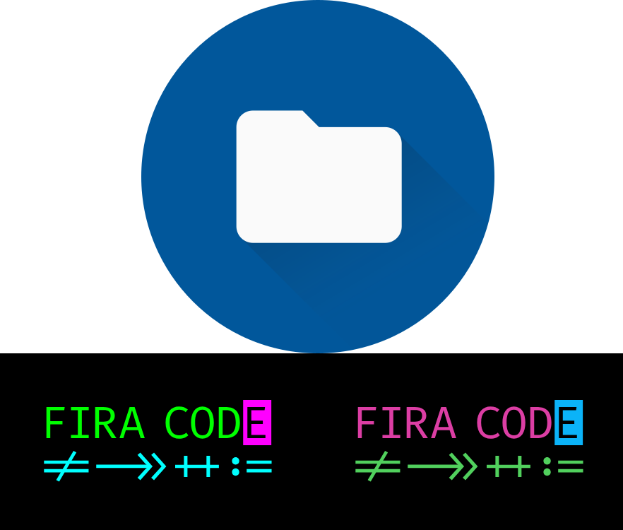

# Fira Code Material Icon Theme


This extension is a fork of [Fira Code Icon Theme](https://github.com/PKief/vscode-material-icon-theme/tree/main) used as a submodule and adding fira code font to the theme.

To use this Extension, you need to add to settings.json the following lines:

```
{
    "workbench.iconTheme": "fira-code-material-icon-theme",
    "editor.fontFamily": "'Fira Code', Menlo, Monaco, 'Courier New', monospace",
    "editor.fontLigatures": true,
}
```